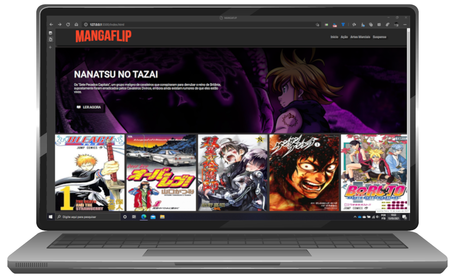

# <strong>MANGAFLIP</strong>

<b>MANGAFLIP</b> é um modelo de site para leitura de mangas online com um desing baseado em uma releitura do <b>NETFLIX</b>.

O projeto foi desenvolvido com base no modelo apresentado na <b>Digital Innovation One</b>, pelo professor <b>Felipe Aguiar</b>.

A titulo de exemplo está disponivel apenas 1 captulo do manga NANATSU NO TAZAI para leitura.

Os outros você mesmo pode implementar se quiser 😁.



## Tecnologias utilizadas

- HTML5
- CSS
- Javascript
- JQuery
- OwlCarousel

## Como editar e rodar este projeto

Faça um clone deste repositório com o comando:

```Git
git clone https://github.com/patrikrufino/mangaflip.git
```

Entre na pasta clonada, e inicie o visual code:

```
cd mangaflip

code .
```

Você pode rodar direto pela estensão do Visual Studio Code, Liveserver, ou abrir o arquivo <b>index.html</b> direto no seu navegador.

### <b>Quer ver como ficou?</b>

Acesse o o deploy do site na <b>Vercel</b>:

https://mangaflip.vercel.app/

### <b>Quer trocar uma ideia?</b>

Me chama no <b>[Linkedin](https://www.linkedin.com/in/patrikalanrufino)</b>
